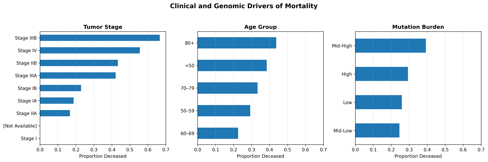
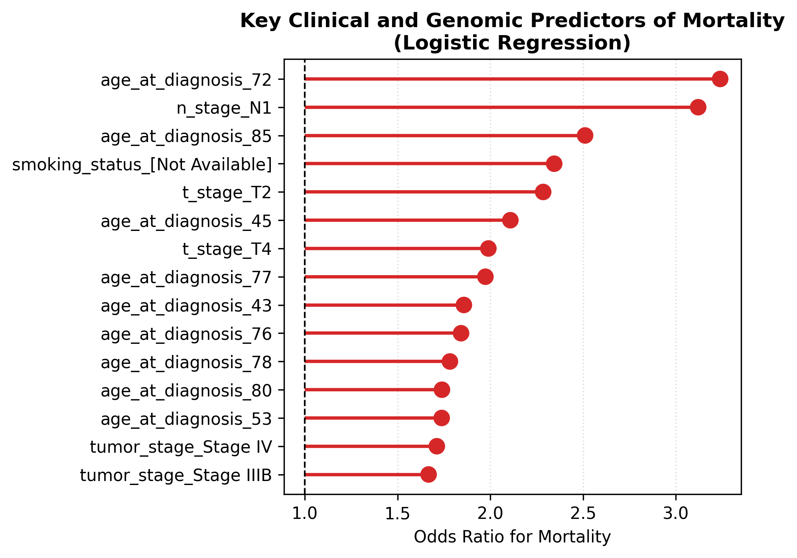
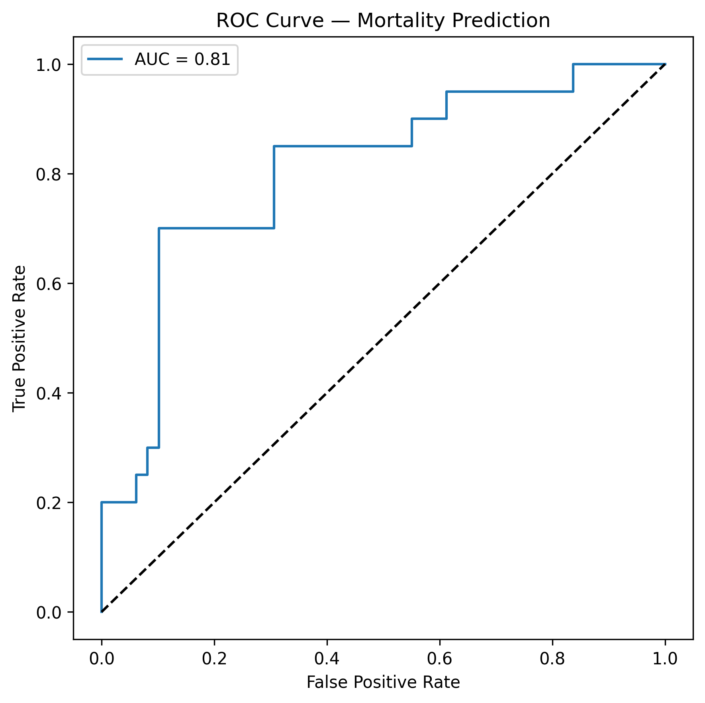

# genie-clinicogenomic-ml# TCGA Lung Adenocarcinoma Mortality Modeling  
**Clinicogenomic Risk Analysis with Interpretable Machine Learning**

---

## Overview
This project demonstrates an end-to-end clinicogenomic analysis using publicly available **TCGA lung adenocarcinoma (LUAD)** data.  
The goal is to model **mortality risk** using interpretable clinical and genomic summary features, while maintaining transparency appropriate for healthcare and biomedical decision-support settings.

Rather than deep genomic sequence modeling, this project focuses on **clinically interpretable predictors**, aligning with how real-world healthcare ML systems are evaluated.
---
## Data
- Source: **TCGA LUAD (The Cancer Genome Atlas)**
- Sample size: ~230 patients (open-access cohort)
## Prediction Output Design

Although the underlying model is trained using a binary outcome
(0 = living, 1 = deceased), the application does **not** expose
binary class predictions to end users.

### Rationale

In clinical decision-support systems, directly predicting or displaying
binary outcomes such as “death” or “survival” is inappropriate and
potentially misleading. Instead, clinical tools standardly present
**probability-based risk estimates**, which support nuanced decision-making
and align with ethical and usability best practices.

### Implementation

- The model outputs calibrated mortality probabilities using `predict_proba`
- The user interface displays:
  - Estimated mortality risk (%)
  - Risk category (Low / Moderate / High)
- Binary class labels are intentionally hidden from the UI

### Calibration

Model probabilities are calibrated and evaluated on held-out data to ensure
that predicted risk levels correspond to observed outcome frequencies.
This supports interpretability and clinical relevance.

### Disclaimer

This application is intended for research and demonstration purposes only
and does not constitute medical advice or clinical decision-making.

- Predictors include:
  - Age at diagnosis  
  - Tumor stage (T, N, overall stage)  
  - Smoking status  
  - Oncogene positivity group  
  - Nonsilent mutation burden (proxy for genomic instability)

> ⚠️ Note: Survival time is **not available** in open-access TCGA clinical tables.  
> Logistic regression is therefore used as the **primary mortality model**, with Cox regression added as a **demonstration model using proxy time**.

---

## Analysis Workflow

### 1. Data Preprocessing
- Standardized column names
- Encoded survival outcome (`event`)
- Removed incomplete rows for modeling
- One-hot encoded categorical variables
- Created interpretable bins:
  - Age groups (`<50`, `50–59`, `60–69`, `70–79`, `80+`)
  - Mutation burden quartiles

---

### 2. Exploratory Analysis
- Compared nonsilent mutation burden by survival status
- Identified heavy right-tail distribution of mutation counts
- Observed higher median mutation burden among deceased patients

---
## 📊 Key Results & Visualizations

This section highlights the **core findings** of the TCGA Lung Adenocarcinoma
clinicogenomic mortality analysis.

---

### 1️⃣ Observed Mortality Patterns (Exploratory Analysis)

Observed mortality proportions stratified by tumor stage, age group, and mutation burden.




---

### 2️⃣ Adjusted Clinical Risk (Logistic Regression Odds Ratios)

Forest plot of adjusted odds ratios from the multivariable logistic regression model.
Values > 1 indicate higher odds of mortality.



---

### 3️⃣ Model Discrimination Performance (ROC Curve)

ROC curve evaluating mortality prediction performance on held-out test data.

- ROC-AUC ≈ 0.8  
- Indicates good discrimination for a small biomedical dataset  




### 3. Logistic Regression (Primary Model)
- Stratified train/test split
- ROC-AUC evaluation
- Cross-validated AUC for robustness
- Extracted **odds ratios** for interpretability

**Why logistic regression?**
- Direct interpretability
- Stable for small biomedical datasets
- Matches real-world clinical risk modeling practices

---

### 4. Interpretable Cross-Tab Analysis
To answer *“Which categories actually have higher mortality?”*, the project computes:

- Row-wise mortality proportions by:
  - Tumor stage
  - T stage
  - N stage
  - Age group
  - Mutation burden quartile

This provides **observed risk**, not just model-estimated risk — a key requirement in clinical ML reviews.

---

### 5. Cox Proportional Hazards Model (Supplementary)
A Cox model is included **for demonstration purposes only**, using mutation burden as a proxy time variable.

This illustrates:
- Familiarity with survival analysis
- Understanding of censoring
- Awareness of modeling limitations when true time-to-event is unavailable

---

## Key Results (Summary)
- Tumor stage and nodal involvement show strong association with mortality
- Older age groups exhibit monotonically increasing mortality proportions
- Higher mutation burden quartiles show elevated observed mortality
- Logistic regression achieves stable discrimination (ROC-AUC ~0.72–0.80 depending on split)

---

## Project Structure

```
genie-clinicogenomic-ml/
├── README.md
├── requirements.txt
├── figures/
│   └── mortality_panel.png
├── notebooks/
│   ├── EDA.ipynb
│   ├── clinical_risk.ipynb
│   ├── forest_plots.ipynb
│   └── figures/
│       ├── roc_curve.png
│       └── odds_ratio_panel.png
├── src/
│   └── genie_clinicogenomic_ml/
│       ├── preprocess.py
│       ├── feature_engineering.py
│       └── models/
│           ├── train_model.py
│           └── evaluate.py

```

## Limitations
- No true survival time available in open-access TCGA clinical tables
- Small sample size limits complex modeling
- Cox model uses proxy time and should **not** be interpreted causally

---

## Skills Demonstrated
- Healthcare data preprocessing
- Interpretable ML modeling
- Survival analysis concepts
- Statistical rigor over black-box models
- Reproducible, modular Python code

---

## Tools & Libraries
- Python, Pandas, NumPy
- scikit-learn
- lifelines
- seaborn / matplotlib

---


